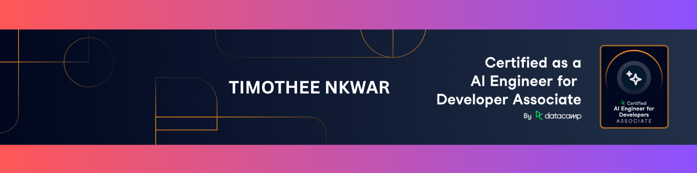

# Timothee Nkwar

  

  <strong>AI Engineer | Data Scientist</strong>

  Nicosia, Cyprus •
  <a href="https://timotheenkwar.me">Website</a> •
  <a href="https://www.linkedin.com/in/timothee-nkwar">LinkedIn</a> •
  <a href="mailto:timotheenkwar@gmail.com">Email</a>

AI Engineer and Data Scientist with a focus on building practical AI and machine learning systems from idea to deployment.

My work currently centers on:
- RAG and LLM applications
- Agentic AI systems
- Fraud detection use cases
- Data pipelines and ML deployment

## Focus Areas

- **RAG / LLM Systems**: RAG chatbots, vector database optimization, and prompt engineering
- **Fraud Detection**: machine learning systems for fraud-related use cases
- **Data Engineering**: ETL pipelines, BigQuery optimization, and real-time streaming
- **MLOps & Deployment**: end-to-end ML lifecycle, CI/CD automation, monitoring, and alerting
- **Collaboration**: project management and cross-functional teamwork

## Tech Stack

## Learning & Certification

- DataCamp: AI Engineer for Developers Associate
- Google Project Management Professional Certificate
- AI & ML Engineering (Microsoft)
- Mathematics for Machine Learning and Data Science (DeepLearning.AI)

## GitHub Snapshot

| GitHub Stats | Top Languages |
| --- | --- |
|  |  |

## Contributions

## Collaboration

Open to collaborating on AI/ML projects, RAG and LLM systems, and practical data products.
